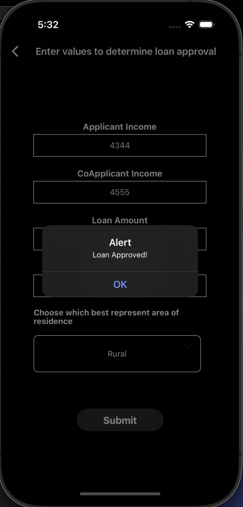
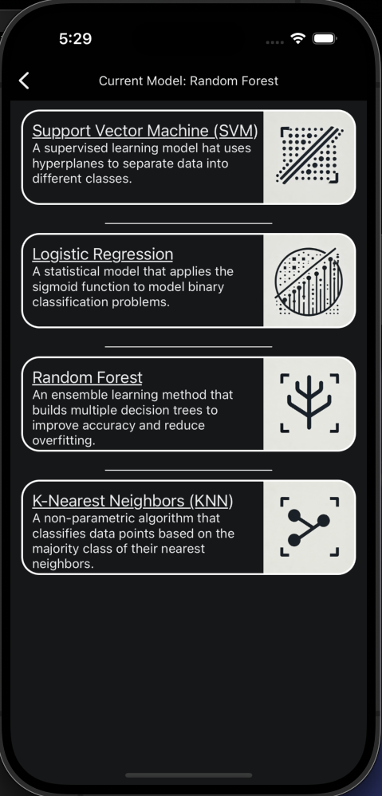

# Loan Approval App
_A full-stack mobile + backend project that predicts loan approvals using machine learning._
##  Overview
This Loan Approval App is a mobile application built with React Native (Expo) and powered by a FastAPI backend.
It uses machine learning models trained on a loan dataset to predict whether an applicant’s loan request
will be approved. The backend supports multiple models so you can compare the performance of each model
##  Available Models
- **Logistic Regression** → Simple, interpretable model for quick results (Recommended).
- **Random Forest** → More accurate, handles complex patterns.
- **K-Nearest Neighbors (KNN)** → Instance-based learning for similarity-based predictions.
- **Support Vector Machine (SVM)** → Robust for small to medium datasets.

Select the model from the app’s dropdown menu to see predictions from different algorithms.

##  Screenshots
### Home Screen


### Prediction Results


### Model Selection Screen


##  How to Run

### 1. Clone the Repository
``` bash
git clone https://github.com/scarmmm/BankApp.git
cd MyApp
```
### 2. Setup Backend
``` bash
cd backend
python3 -m venv venv
source venv/bin/activate

pip install -r requirements.txt
uvicorn app.main:app --reload --host 0.0.0.0 --port 8000
```

### 3. Setup Frontend
``` bash
cd ../frontend
npm install
npx expo start
##run ios simulator 