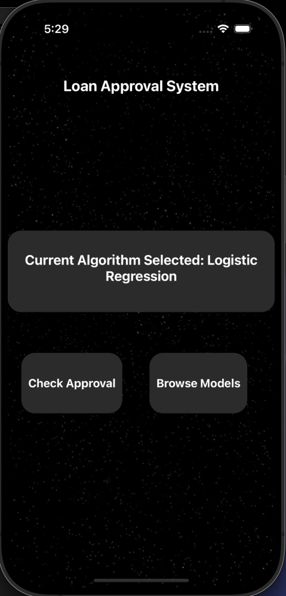

{\rtf1\ansi\ansicpg1252\cocoartf2822
\cocoatextscaling0\cocoaplatform0{\fonttbl\f0\fswiss\fcharset0 Helvetica;}
{\colortbl;\red255\green255\blue255;}
{\*\expandedcolortbl;;}
\margl1440\margr1440\vieww11520\viewh8400\viewkind0
\pard\tx720\tx1440\tx2160\tx2880\tx3600\tx4320\tx5040\tx5760\tx6480\tx7200\tx7920\tx8640\pardirnatural\partightenfactor0

\f0\fs24 \cf0 # Loan Approval App\
_A full-stack mobile + backend project that predicts loan approvals using machine learning._\
##  Overview\
This Loan Approval App is a mobile application built with React Native (Expo) and powered by a FastAPI backend.\
It uses machine learning models trained on a loan dataset to predict whether an applicant\'92s loan request\
will be approved. The backend supports multiple models so you can compare the performance of each model\
##  Available Models\
- **Logistic Regression** \uc0\u8594  Simple, interpretable model for quick results (Recommended).\
- **Random Forest** \uc0\u8594  More accurate, handles complex patterns.\
- **K-Nearest Neighbors (KNN)** \uc0\u8594  Instance-based learning for similarity-based predictions.\
- **Support Vector Machine (SVM)** \uc0\u8594  Robust for small to medium datasets.\
\
Select the model from the app\'92s dropdown menu to see predictions from different algorithms.\
\
##  Screenshots\
### Home Screen\
\
\
### Prediction Results\
\
\
### Model Selection Screen\
\
\
##  How to Run\
\
### 1. Clone the Repository\
``` bash\
git clone https://github.com/scarmmm/BankApp.git\
cd MyApp\
```\
### 2. Setup Backend\
``` bash\
cd backend\
python3 -m venv venv\
source venv/bin/activate\
\
pip install -r requirements.txt\
uvicorn app.main:app --reload --host 0.0.0.0 --port 8000\
```\
\
### 3. Setup Frontend\
``` bash\
cd ../frontend\
npm install\
npx expo start\
##run ios simulator \
}